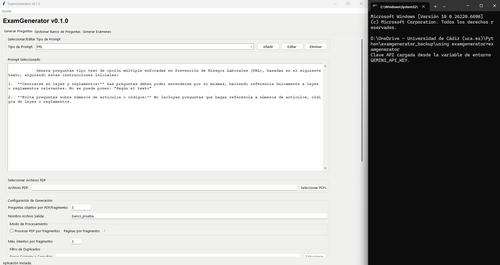

## Uso de la pestaña "Generar Exámenes"

### Parte 6: Usando la Pestaña "Generar Exámenes"

Esta pestaña es tu imprenta personal de exámenes. Aquí tomarás las preguntas que has generado y curado, y las convertirás en documentos de examen completos, con múltiples versiones, hojas de respuesta y mucho más.

Para nuestro ejemplo, vamos a crear un examen de 5 preguntas (2 del tema `PRL - LPRL` y 3 del tema `PRL - RSP`), generando dos versiones diferentes (Tipo A y Tipo B).

#### Sección 1: Archivo Excel de preguntas

*   **Qué es:** El punto de partida. Aquí debes seleccionar tu banco de preguntas principal, el archivo maestro que contiene todas tus preguntas aprobadas de todos los temas.
*   **Acción para nuestro ejemplo:** Haz clic en **"Seleccionar Archivo"** y elige tu archivo **`banco_principal.xlsx`** (el que actualizamos en la pestaña anterior).

#### Sección 2: Datos del examen

Esta sección define la cabecera y la información básica que aparecerá en el examen.

*   **Asignatura:** El nombre de la materia.
    *   **Acción:** Escribe `Prevención de Riesgos Laborales`.
*   **Curso:** El año académico.
    *   **Acción:** Escribe `2024-2025`.
*   **Nombre del Examen:** El título del examen (ej. "Parcial 1", "Examen Final").
    *   **Acción:** Escribe `Examen Temas LPRL y RSP`.
*   **Número de Exámenes a Generar:** ¿Cuántas versiones diferentes del examen quieres crear? Cada versión tendrá las mismas preguntas, pero en un orden diferente y con las respuestas también barajadas.
    *   **Acción:** Escribe `2`.
*   **Nombres de los Exámenes (separados por coma):** Si quieres nombres específicos para cada versión (ej. "Modelo A", "Recuperación"), escríbelos aquí.
    *   **Acción:** Escribe `Tipo A,Tipo B`.

#### Sección 3: Selección de preguntas por tema

Aquí es donde decides exactamente qué preguntas incluir en tu examen. Tienes un control total.

*   **Seleccionar cantidad por tema:** Esta opción te muestra una lista de todos los temas disponibles en tu banco de preguntas y te permite elegir cuántas preguntas quieres de cada uno. Es muy visual e intuitiva.
*   **Mismo número de preguntas por tema:** Una opción rápida si quieres, por ejemplo, 2 preguntas de cada tema sin tener que especificarlo uno por uno.
*   **Diccionario de preguntas por tema:** La opción más potente para scripting, pero también útil aquí. Escribes directamente tu selección en formato `NombreDelTema:Cantidad`.
*   **Acción para nuestro ejemplo:**
    1.  Haz clic en la opción **"Seleccionar cantidad por tema"**.
    2.  Al seleccionar tu archivo Excel, la aplicación cargará automáticamente los temas. Verás dos filas en el área de selección: **`PRL - LPRL`** y **`PRL - RSP`**.
    3.  En el pequeño cuadro numérico (Spinbox) al lado de **`PRL - LPRL`**, selecciona **`2`**.
    4.  En el cuadro numérico al lado de **`PRL - RSP`**, selecciona **`3`**.
    Esto le dice al programa que cree un examen con 2 preguntas de la Ley y 3 del Reglamento.

#### Sección 4: Método de selección

Una vez que le has dicho al programa *cuántas* preguntas quieres de cada tema, aquí le dices *cómo* debe elegirlas.

*   **azar:** El programa seleccionará las preguntas de forma completamente aleatoria de entre todas las disponibles para ese tema. **Esta es la mejor opción para crear exámenes justos y diferentes cada vez.**
*   **primeras:** Seleccionará las primeras preguntas que encuentre en el archivo Excel para ese tema.
*   **menos usadas:** Una función avanzada muy útil. El programa lleva un registro de cuántas veces se ha usado cada pregunta en exámenes anteriores y elegirá las que se hayan usado menos. ¡Perfecto para asegurar que todo el temario se evalúa a lo largo del tiempo!
*   **Acción para nuestro ejemplo:** Selecciona **"azar"** en el menú desplegable.

#### Sección 5: Estilo del documento

Aquí personalizas el aspecto visual de tu examen en el archivo de Word.

*   **Márgenes (Superior, Inferior, Izquierdo, Derecho):** Define el espacio en blanco alrededor de la página, en pulgadas. Los valores por defecto suelen funcionar bien.
*   **Tamaño de Fuente:** El tamaño del texto de las preguntas y respuestas.
*   **Instrucciones Hoja de Respuestas:** El texto que aparecerá justo encima de la tabla de respuestas para guiar al alumno.
*   **Acción para nuestro ejemplo:** En "Instrucciones Hoja de Respuestas", escribe: `Marque con una "X" la casilla correspondiente a la respuesta correcta. No se permiten tachaduras.`

#### Sección 6: Configuración para Moodle

¡Una de las funciones más potentes! Si usas la plataforma online Moodle, ExamGenerator puede crear un archivo especial para que subas las preguntas del examen directamente a tu curso.

*   **Exportar a Moodle XML:** Marca esta casilla para activar la exportación.
*   **Penalización (-%):** En Moodle, puedes hacer que las respuestas incorrectas resten puntos. Aquí indicas el porcentaje negativo (ej. `-25` para que un error reste un 25% del valor de la pregunta).
*   **Texto Adicional Moodle XML:** Un texto extra para organizar tus preguntas dentro de Moodle.
*   **Acción para nuestro ejemplo:** **Marca la casilla**. En el campo `Texto Adicional Moodle XML`, puedes escribir lo que quieras. Nosotros vamos a escribir `Examen Temas LPRL y RSP`, aunque en este caso se mostrará de forma redundante (en Moodle se mostrará `Examen Temas LPRL y RSP - Examen Temas LPRL y RSP`).

#### Sección 7: Actualizar archivo Excel con uso

*   **Qué es:** Si marcas esta casilla, después de generar el examen, el programa abrirá tu `banco_principal.xlsx` y anotará qué preguntas se han utilizado y en qué examen. Esto alimenta la función "menos usadas" que vimos antes.
*   **Acción para nuestro ejemplo:** **Marca la casilla "Actualizar Archivo Excel con Uso"**. Es una buena práctica para mantener tu banco de preguntas siempre al día.

#### Sección 8: Directorio de salida y ¡generar!

*   **Directorio de Salida para Exámenes:** La carpeta donde se guardarán todos los archivos del examen.
*   **Acción para nuestro ejemplo:** Crea una carpeta llamada **`examenes generados`** en tu carpeta de trabajo, y selecciónala.
*   **Botón "Generar Exámenes":** ¡El momento de la verdad! Haz clic en este botón.

### Parte 7: ¡Tus exámenes están listos!

Ve a tu carpeta de trabajo. Verás que, además de los documentos de Word y Excel, ahora se han creado archivos especiales para Moodle. Esto es lo que encontrarás:

*   **`examen_Prevención de Riesgos Laborales_Examen Temas LPRL y RSP_24-25_Tipo A.docx`**: El examen para el alumno, listo para imprimir.
*   **`examen_..._Tipo B.docx`**: La segunda versión del examen, con preguntas y respuestas barajadas.
*   **`examen_..._Tipo A_completo.docx`**: La versión para el profesor, con las respuestas correctas y el tema de cada pregunta.
*   **`examen_..._Tipo B_completo.docx`**: La versión del profesor para el Tipo B.
*   **`examen_..._Tipo A_completo.xlsx`** y **`..._Tipo B_completo.xlsx`**: Archivos de Excel con los datos exactos de cada examen.

**¡Y ahora, los archivos para la auto-corrección en Moodle!**

*   **`examen_Prevención de Riesgos Laborales_Examen Temas LPRL y RSP_24-25_Tipo A.xml`**
*   **`examen_..._Tipo B.xml`**

    *   **¿Qué son estos archivos?** ¡Aquí es donde ocurre la magia! Estos no son archivos de examen normales. Son ficheros de importación que contienen las preguntas de forma **anónima**, diseñados específicamente para la auto-corrección.
        *   Dentro de Moodle, el enunciado de la pregunta no será el texto completo, sino simplemente **"Pregunta 1", "Pregunta 2", etc.**
        *   Las opciones de respuesta no serán los textos completos, sino simplemente **"a", "b", "c", y "d"**.
        *   La lógica de cuál es la respuesta correcta para cada pregunta está oculta dentro del archivo, pero invisible para el alumno.

    *   **¿Cómo se usan? (El Flujo de Auto-Corrección)**
        1.  **Examen en Papel:** Los alumnos realizan el examen impreso (`.docx`) y marcan sus respuestas en la hoja de respuestas física que viene al final del documento.
        2.  **Importación a Moodle:** Tú, como profesor, subes el archivo `.xml` (por ejemplo, el del Tipo A) a la sección **"Banco de preguntas"** de tu curso en Moodle.
        3.  **Creación del Cuestionario:** Creas un nuevo "Cuestionario" en Moodle y añades las preguntas que acabas de importar desde el banco.
        4.  **Transferencia de Respuestas:** Una vez finalizado el examen en papel, los alumnos se quedan únicamente con su hoja de respuestas. Acceden al cuestionario de Moodle y ven una simple lista:
            *   Pregunta 1: [ ] a [ ] b [ ] c [ ] d
            *   Pregunta 2: [ ] a [ ] b [ ] c [ ] d
            *   ...y así sucesivamente.
            Su tarea es simplemente transferir las respuestas de su hoja de papel a este formulario digital.
        5.  **Corrección Automática:** En cuanto los alumnos envían el cuestionario, Moodle lo corrige al instante, ya que sabe cuál es la respuesta correcta para "Pregunta 1", "Pregunta 2", etc., según el archivo `.xml` que importaste.
        6.  **Verificación:** Tienes las notas de todos los alumnos calculadas automáticamente en Moodle, y conservas las hojas de respuesta físicas para cualquier revisión o verificación necesaria.

Además, si abres tu archivo `banco_principal.xlsx`, verás que se ha añadido una nueva columna (`Examen Temas LPRL y RSP_24-25_uso`) y que la columna `Veces usada en examen` se ha actualizado para las 5 preguntas que se incluyeron en el examen.

¡Felicidades! Has completado todo el ciclo: desde múltiples PDFs en bruto hasta un examen multi-tema profesional, listo para entregar en papel y con un sistema de auto-corrección para Moodle que te ahorrará horas de trabajo.

