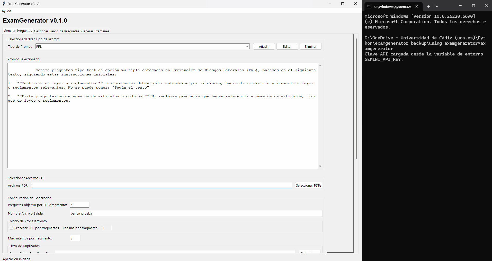
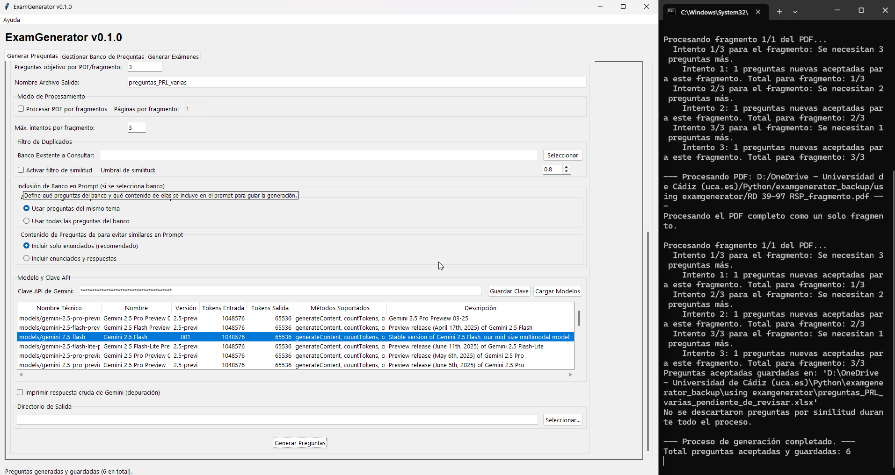

## Uso de la pestaña "Generar Preguntas"

### Parte 2: Generando preguntas

Ahora vamos a realizar nuestro ejemplo práctico: generar preguntas de dos temas diferentes, la Ley de Prevención y el Reglamento de los Servicios de Prevención.

Asegúrate de tener ambos archivos en tu carpeta de trabajo: `RD 31-95 LPRL_fragmento.pdf` y `RD 39-97 RSP_fragmento.pdf`.

#### Sección 1: Seleccionar/Editar tipo de prompt

Un "Prompt" son las instrucciones que le damos a la inteligencia artificial.

*   **Tipo de Prompt:** Este menú desplegable contiene plantillas de instrucciones. Como ambos documentos son de temática legal sobre prevención, la mejor opción es **PRL**.
*   **Acción para nuestro ejemplo:** Selecciona **PRL** en el menú desplegable.

#### Sección 2: Seleccionar archivos PDF

Aquí le decimos al programa qué documentos debe leer.

*   **Botón "Seleccionar PDFs":** Haz clic en este botón para buscar archivos en tu ordenador.
*   **Acción para nuestro ejemplo:** En la ventana que se abre, busca tus archivos. Para seleccionar ambos a la vez, haz clic en el primero (`RD 31-95...`) y, **manteniendo pulsada la tecla `Ctrl`**, haz clic en el segundo (`RD 39-97...`). Luego, pulsa "Abrir". Verás las rutas de ambos archivos en el campo de texto, separadas por una coma.

#### Sección 3: Configuración de generación

Esta es la parte más importante, donde personalizamos la tarea.

*   **Preguntas objetivo por PDF/fragmento:**
    *   **Qué es:** El número de preguntas que quieres que la IA intente crear **por cada PDF** que has seleccionado.
    *   **Acción para nuestro ejemplo:** Borra el valor que haya y escribe **`3`**. El programa intentará generar 3 preguntas del primer PDF y 3 del segundo, para un total de 6 preguntas.

*   **Nombre Archivo Salida:**
    *   **Qué es:** El nombre base que tendrán los archivos que se generen.
    *   **Acción para nuestro ejemplo:** Escribe un nombre que represente el contenido, como **`preguntas_PRL_varias`**.

*   **Modo de Procesamiento:**
    *   **Procesar PDF por fragmentos:** Si marcas esta casilla, el programa no enviará el PDF completo a la IA de una sola vez. En su lugar, lo dividirá en fragmentos más pequeños. Es ideal para documentos muy largos (más de 20-30 páginas) para asegurar que la IA lee y extrae información de todas las partes del texto.
    *   **Páginas por fragmento:** Este campo (que se activa al marcar la casilla) te permite decidir cuántas páginas tendrá cada fragmento. Por ejemplo, si pones `5`, la IA trabajará con las páginas 1-5, luego 6-10, y así sucesivamente.
    *   **Acción para nuestro ejemplo:** Nuestros PDFs son cortos, así que **deja la casilla DESMARCADA**.

*   **Máx. intentos por fragmento:**
    *   **Qué es:** A veces, la IA no genera el número exacto de preguntas a la primera. Este número le dice cuántas veces puede volver a intentarlo para alcanzar el objetivo.
    *   **Acción para nuestro ejemplo:** El valor por defecto, **`3`**, es perfecto. No necesitas cambiarlo.

*   **Filtro de Duplicados:**
    *   **Qué es:** Una potente herramienta para evitar añadir preguntas repetidas a un banco que ya existe.
    *   **Banco Existente a Consultar:** Aquí seleccionarías tu archivo Excel principal de preguntas.
    *   **Activar filtro de similitud:** Si la marcas, la aplicación comparará cada nueva pregunta generada con todas las de tu banco existente.
    *   **Umbral de similitud:** Un valor entre 0.0 y 1.0 que define qué tan parecida debe ser una pregunta para ser descartada (ej. 0.8 significa 80% similar).
    *   **Acción para nuestro ejemplo:** Como estamos creando nuestro primer banco, **dejaremos todos estos campos vacíos y las casillas desmarcadas**.

*   **Inclusión de Banco en Prompt:**
    *   **Qué es:** Le da "ejemplos" a la IA de las preguntas que ya tienes para que intente ser más original y no repetir conceptos.
    *   **Alcance:** Le dice a la IA si debe fijarse en las preguntas del mismo tema o en todas las preguntas de tu banco.
    *   **Contenido:** Le dice a la IA si los ejemplos deben incluir solo el enunciado o también las respuestas.
    *   **Acción para nuestro ejemplo:** Como no estamos usando un banco existente, **ignoraremos esta sección**.

*   **Modelo y Clave API:**
    *   **Clave API de Gemini:** Si configuraste la variable de entorno, la aplicación ya la habrá detectado. Si no, pega aquí tu clave API.
    *   **Botón "Cargar Modelos":** **¡Este paso es crucial!** Haz clic en este botón. La aplicación usará tu clave para conectarse a Google y obtener una lista de los "cerebros" de IA disponibles.
    *   **Tabla de Modelos:** Después de cargar, la tabla se llenará. Verás modelos como `gemini-2.5-flash-latest` o `gemini-2.5-pro-latest` con todos sus detalles. Te explicamos las columnas:
        *   **Nombre Técnico:** El nombre "oficial" que usa el programa para comunicarse con la IA.
        *   **Nombre:** Un nombre más amigable y fácil de leer.
        *   **Versión:** La versión específica del modelo.
        *   **Tokens Entrada/Salida:** Piensa en esto como la "memoria" o la capacidad de la IA. Números más altos significan que puede procesar documentos más largos y generar respuestas más extensas de una sola vez.
        *   **Métodos Soportados:** Las tareas que el modelo puede realizar (para nosotros, lo importante es que incluya `generateContent`).
        *   **Descripción:** Una breve explicación de Google sobre para qué es mejor cada modelo.
    *   **Acción para nuestro ejemplo:** Haz clic en una de las filas de la tabla para seleccionar un modelo. Una excelente opción es **`gemini-2.5-flash`**, que es rápido y muy potente.

*   **Imprimir respuesta cruda de Gemini (depuración):**
    *   **Qué es:** Esta es una opción para usuarios avanzados o para cuando algo no funciona bien. Si la marcas, en la ventana negra de la línea de comandos (la que usaste para iniciar el programa) se imprimirá el texto exacto que devuelve la IA, sin ningún formato. Es útil para diagnosticar problemas.
    *   **Acción para nuestro ejemplo:** Para un uso normal, **deja esta casilla DESMARCADA**.

*   **Directorio de Salida:**
    *   **Qué es:** La carpeta donde se guardarán los archivos generados.
    *   **Acción para nuestro ejemplo:** Puedes dejar este campo **en blanco**. Como iniciamos la aplicación desde nuestra carpeta de trabajo, los archivos se guardarán allí automáticamente.

#### Sección 4: ¡A generar!

Ya está todo configurado.

*   **Botón "Generar Preguntas":** Haz clic en este gran botón en la parte inferior.
*   **¿Qué pasará ahora?:** La aplicación se quedará "pensando" por unos segundos. Cuando termine, aparecerá una ventana emergente confirmando que las preguntas se han generado con éxito.

### Parte 3: Revisa tus resultados

Ve a tu carpeta de trabajo. Dentro, encontrarás dos archivos nuevos:

1.  **`preguntas_PRL_varias_pendiente_de_revisar.xlsx` (Archivo de Excel):** El banco de preguntas en formato de datos.
2.  **`preguntas_PRL_varias_pendiente_de_revisar.docx` (Archivo de Word):** **¡Este es el archivo importante para ti!** Ábrelo. Verás un total de 6 preguntas (3 de cada PDF), cada una con sus opciones, la respuesta correcta y el "Texto relevante" que justifica la respuesta.

**Tu siguiente paso sería leer este archivo de Word, corregir cualquier error que veas, y prepararlo para añadirlo a tu banco de preguntas principal, ¡pero eso lo veremos en el tutorial de la siguiente pestaña!**

¡Felicidades! Has usado con éxito la inteligencia artificial para automatizar la creación de preguntas de examen a partir de múltiples fuentes.

