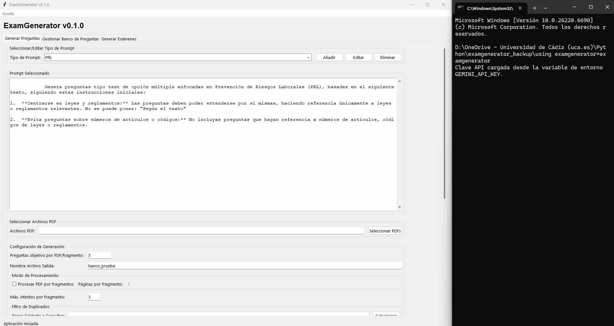
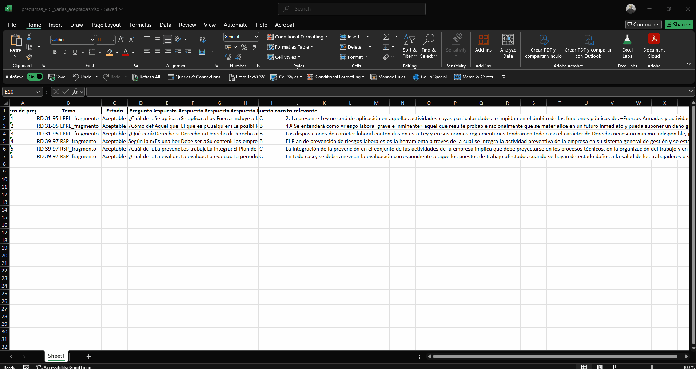
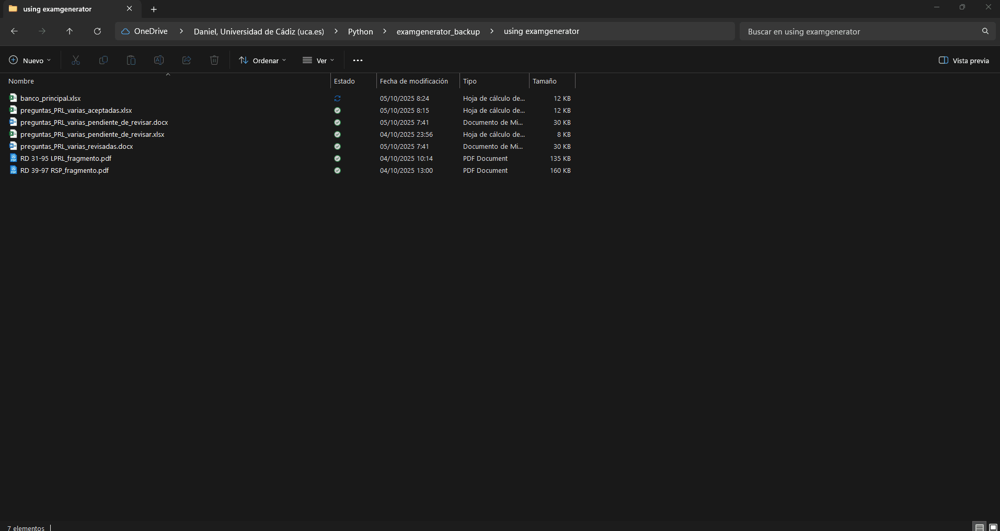

## Uso de la pestaña "Gestionar Banco de Preguntas"

### Parte 4: Revisar y aprobar las preguntas

Antes de usar la siguiente pestaña, hay un paso vital que ocurre fuera de la aplicación: **tu revisión experta**. La IA es una herramienta fantástica, pero tú eres quien garantiza la calidad.

1.  **Abre el Archivo de Word:** Ve a tu carpeta de trabajo y abre el archivo `preguntas_PRL_varias_pendiente_de_revisar.docx`.

2.  **Revisa y Corrige:** Lee cada una de las 6 preguntas, sus opciones y la respuesta correcta.
    *   ¿Hay algún error gramatical? ¡Corrígelo!
    *   ¿Podría una opción ser más clara? ¡Mejórala!
    *   ¿La respuesta marcada como correcta es realmente la correcta según el texto? Si no, cambia la letra en la línea "Respuesta correcta:".

3.  **¡El Paso Clave! Cambia el Estado:** Para cada pregunta que consideres que está lista para ser usada en un examen, busca la línea `Estado: Pendiente de revisar` y cámbiala por `Estado: Aceptable`. **No te preocupes por el nombre del tema en este paso, lo ajustaremos más eficientemente después.**

4.  **Guarda el Archivo:** Una vez que hayas revisado y aprobado tus preguntas, usa "Guardar como..." y dale un nombre nuevo para no confundirte, por ejemplo: **`preguntas_PRL_varias_revisadas.docx`**.

Ahora que tenemos nuestro documento de Word revisado y aprobado, estamos listos para volver a ExamGenerator.

### Parte 5: Usando la pestaña "Gestionar Banco de Preguntas"

Esta pestaña es tu centro de control para mantener y hacer crecer tu colección de preguntas.

#### Tarea 1: Generar un archivo Excel (XLSX) desde tu Word revisado

El programa no puede trabajar directamente con un archivo de Word. Primero, necesitamos convertir nuestro `.docx` revisado de nuevo a un formato de datos estructurado que la aplicación entienda: un archivo de Excel (`.xlsx`).

*   **Archivo DOCX Revisado:**
    *   **Acción:** Haz clic en el botón **"Seleccionar DOCX"** y elige tu archivo **`preguntas_PRL_varias_revisadas.docx`**.

*   **Directorio de Salida (XLSX):**
    *   **Acción:** Déjalo **en blanco**. Se guardará en tu carpeta de trabajo actual.

*   **Nombre del Nuevo Archivo XLSX:**
    *   **Acción:** Escribe un nombre descriptivo, como **`preguntas_PRL_varias_aceptadas`**.

*   **Botón "Guardar XLSX Revisado":**
    *   **Acción:** Haz clic en él. En un instante, la aplicación leerá tu documento de Word y creará un archivo `preguntas_PRL_varias_aceptadas.xlsx` en tu carpeta de trabajo.

#### Tarea 1.5: Organizar los nombres de los temas

Ahora tenemos un archivo Excel limpio con nuestras preguntas aprobadas. Antes de fusionarlo, vamos a darle los nombres de tema definitivos.

1.  **Abre el Archivo de Excel:** Ve a tu carpeta de trabajo y abre el archivo que acabamos de crear: **`preguntas_PRL_varias_aceptadas.xlsx`**.
2.  **Edita la Columna "Tema":**
    *   Para las preguntas que vinieron del `RD 31-95...`, reemplaza el nombre largo del archivo en la columna **Tema** por **`PRL - LPRL`**.
    *   Para las preguntas que vinieron del `RD 39-97...`, reemplaza el nombre largo del archivo por **`PRL - RSP`**.
3.  **Guarda y Cierra** el archivo de Excel.

Ten en cuenta que este paso es opcional. Si desde el principio, hubiéramos llamado a los pdfs "Tema 1.pdf" y "Tema 2.pdf", no haría falta modificarlos en el archivo Excel.

¡Perfecto! Ahora tienes un lote de preguntas de alta calidad, revisadas y perfectamente organizadas por temas, listas para ser añadidas a tu colección principal.

#### Tarea 2: Añadir tus nuevas preguntas al banco principal

Ahora vamos a fusionar las preguntas de nuestros dos nuevos temas con tu colección principal de preguntas (tu "banco").

*   **Banco Existente:**
    *   **Acción:** Haz clic en **"Seleccionar"** y elige tu archivo maestro, **`banco_principal.xlsx`**.

*   **Archivo a Añadir:**
    *   **Acción:** Haz clic en **"Seleccionar"** y elige el archivo que acabamos de editar: **`preguntas_PRL_varias_aceptadas.xlsx`**.

*   **Criterio de Duplicado:**
    *   **Acción:** Elige **"Pregunta y Respuestas Iguales"** para la comprobación más estricta.

*   **Filtro de Estado:**
    *   **Acción:** Elige **"Añadir solo con estado 'Aceptable'"**. Esto asegura que solo las preguntas que has aprobado personalmente entren en tu banco principal.

*   **Botón "Añadir Preguntas sin Duplicados":**
    *   **Acción:** Haz clic en él.

Después de hacer clic en el botón, la aplicación analizará ambos archivos y te mostrará una ventana emergente informándote cuántas preguntas nuevas (no duplicadas y con estado "Aceptable") ha encontrado.

Luego, te preguntará cómo quieres guardar el resultado. Tienes tres opciones:
*   **Sí:** Sobrescribe tu `banco_principal.xlsx` con la nueva versión que incluye las preguntas añadidas.
*   **No:** Te permite guardar el resultado como un archivo nuevo.
*   **Cancelar:** Aborta la operación de guardado.

**Acción para nuestro ejemplo:** Haz clic en **"Sí"** para actualizar directamente tu banco principal.

¡Y ya está! Ve a tu carpeta de trabajo y abre tu archivo `banco_principal.xlsx`. Verás que ahora contiene las 6 preguntas de los temas **`PRL - LPRL`** y **`PRL - RSP`** que generamos, revisamos y añadimos. Tu banco de preguntas ha crecido, ¡y todo de forma organizada y sin duplicados

